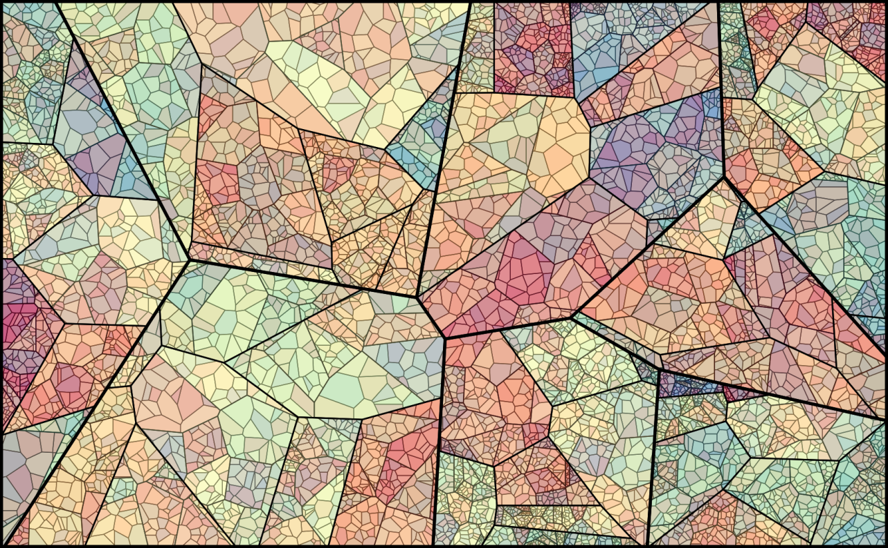

<div align="center">

# Voronoi Intelligence

**Voronoi-based seed management for evolutionary algorithms, agent populations, and spatial reasoning in AGI systems.**

[](LICENSE)
[](https://python.org)
[](https://github.com/astral-sh/ruff)
[]()



*A Voronoi diagram partitions space into cells, each governed by one seed. The seeds (black points) are the core primitive of this library — they can be sampled, evolved, learned, or exchanged between agents to control coverage, diversity, and exploration.*

</div>

---

## Why Voronoi Diagrams for AGI?

A **Voronoi diagram** partitions a space into regions where every point in a region is closer to that region's *seed* (generator point) than to any other seed. This simple geometric construction turns out to be a powerful abstraction for several open problems in AGI research:

| Problem | Voronoi Solution |
|---------|-----------------|
| **Population diversity** in evolutionary algorithms | One individual per cell = guaranteed spacing without explicit niching |
| **Exploration vs. exploitation** | Cell size controls mutation step size; sparse regions get larger mutations |
| **Multi-agent territory assignment** | Each agent owns a cell; re-tessellate when agents move or die |
| **Novelty search** | Novelty = inverse cell area × behavioural distance to archive |
| **High-dimensional search** | Seeds as "anchor points"; Voronoi adjacency defines neighbourhood structure |
| **Prompt/behaviour spaces** | Partition the latent space of LLM outputs into semantically distinct regions |

> **Core thesis**: Seeds are a learnable, evolvable, controllable representation for spatial reasoning in AGI. Treating them as first-class citizens — rather than byproducts of a tessellation — unlocks better initialisation, diversity, and coordination in agentic and evolutionary systems.

## Key Concepts

### Seeds (Generator Points)
The fundamental primitive. A seed is a point in the search space. The collection of seeds defines the Voronoi tessellation. Seeds can be:
- **Sampled** (uniform, Poisson-disk, Sobol, Gaussian mixture)
- **Evolved** (mutation/crossover with cell-size-aware step sizes)
- **Learned** (via density estimation or gradient-based adaptation)
- **Exchanged** between agents during communication

### Territories
Each seed owns a Voronoi cell — its *territory*. Territory properties (area, vertex count, neighbours) provide rich metadata for:
- Adaptive mutation rates
- Fitness sharing without pairwise distance thresholds
- Load balancing in multi-agent systems

### Tessellation Dynamics
As seeds move (via evolution, agent behaviour, or external pressure), the tessellation updates. This creates a **dynamic spatial structure** that can encode:
- Population structure in GAs
- Agent influence zones in multi-agent systems
- Attention regions in perceptual architectures

## Installation

```bash
# Clone the repo
git clone git@github.com:NullLabTests/voronoi_intelligence.git
cd voronoi_intelligence

# Install core dependencies
pip install -e .

# With dev/test dependencies
pip install -e ".[dev]"

# Full install
pip install -e ".[dev,viz,ml]"
```

### Quick Start

```python
import numpy as np
from voronoi_agi import (
    UniformSeedSampler,
    VoronoiPopulation,
    VoronoiGA,
    plot_voronoi_2d,
)

# 1. Sample seeds
sampler = UniformSeedSampler(n_seeds=50, dim=2)
seeds = sampler.sample()

# 2. Define a simple optimisation problem
def fitness(x):
    return -np.sum((x - 0.5) ** 2)  # maximise proximity to centre

# 3. Create a Voronoi-structured population
pop = VoronoiPopulation.from_sampler(
    sampler,
    individual_factory=lambda s: s,
    fitness_fn=fitness,
)

# 4. Run a Voronoi-enhanced GA
ga = VoronoiGA(population=pop, mutation_rate=0.15)
history = ga.run(n_generations=50)

# 5. Visualise
plot_voronoi_2d(seeds)
```

## Modules

| Module | Description |
|--------|-------------|
| `seeds` | Seed sampling strategies (uniform, Poisson-disk, Sobol, Gaussian) |
| `population` | Voronoi-structured population with diversity metrics and territorial niching |
| `evolution` | Territory-aware GA: selection, mutation, crossover, novelty search |
| `agents` | Multi-agent coverage control with dynamic Voronoi territories |
| `visualization` | 2D plotting, heatmaps, population animation |
| `utils` | Normalisation, point-in-polygon, random sampling within cells |

## Examples

| Example | File | What It Shows |
|---------|------|---------------|
| Seed distribution strategies | `examples/01_seed_distribution.png` | Side-by-side comparison of uniform, Poisson, Sobol, Gaussian seeds |
| Voronoi-enhanced GA | `examples/02_voronoi_ga.py` | Continuous optimisation benchmark (Rastrigin, Ackley) with territory-aware operators |
| Multi-agent coverage | `examples/03_multiagent_coverage.py` | Agents dynamically partitioning a 2D domain, reacting to a density field |
| Prompt evolution | `examples/04_prompt_evolution.py` | Using Voronoi seeds to structure a population of LLM prompts |

```bash
# Run any example
python examples/02_voronoi_ga.py
```

## Research Value

### For Evolutionary Computation
- **No explicit niching parameters** — cell structure provides natural diversity
- **Adaptive mutation** — step size proportional to cell area
- **Computationally cheap** — Voronoi tessellation is O(n log n) in 2D, O(n log n) in higher dims with Qhull
- **Composable** — works with any genotype representation that can be embedded in a metric space

### For Multi-Agent Systems
- **Provable coverage** — union of bounded Voronoi cells covers the convex hull of seeds
- **Load balancing** — centroidal Voronoi tessellation (Lloyd's algorithm) equalises territory size
- **Distributed** — agents need only know their own cell vertices and neighbour IDs
- **Dynamic** — re-tessellation on agent death/spawn is O(n log n)

### For AGI Architecture
- **Sparse attention** — Voronoi regions define a sparse graph of "attentional territories"
- **Modular representation** — each seed can carry memory, policy, or parameters
- **Emergent specialisation** — seeds evolve to cover high-value regions of representation space

## Related Work

- [Deb & Goldberg (1989)](https://doi.org/10.1016/B978-0-12-386441-5.50008-4) — Fitness sharing in genetic algorithms
- [Cortés et al. (2004)](https://doi.org/10.1109/TAC.2004.832766) — Coverage control for multi-agent systems
- [Lehman & Stanley (2011)](https://doi.org/10.1162/EVCO_a_00025) — Novelty search
- [Lloyd (1982)](https://doi.org/10.1109/TIT.1982.1056489) — Least squares quantization in PCM (Lloyd's algorithm / centroidal Voronoi)
- [Okabe et al. (2000)](https://www.springer.com/gp/book/9783540431697) — Spatial Tessellations (comprehensive reference)

## Citation

If you use this work in your research:

```bibtex
@software{voronoi_intelligence_2026,
  author = {NullLabTests},
  title = {Voronoi Intelligence: Seed-Based Spatial Reasoning for AGI},
  year = {2026},
  url = {https://github.com/NullLabTests/voronoi_intelligence},
}
```

## License

MIT — see [LICENSE](LICENSE).

---

<div align="center">
<b>Voronoi Intelligence</b> — seeds are all you need.
</div>
